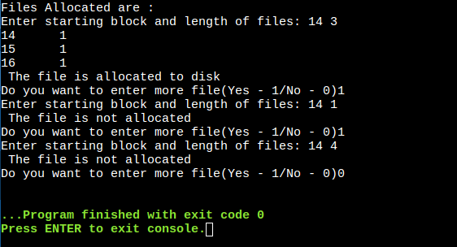
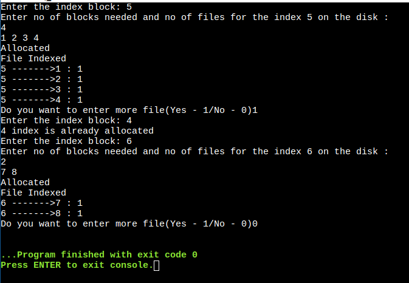
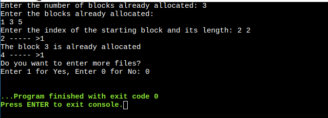

# OS-EX.12-IMPLEMENTATION-OF-FILE-ALLOCATION-METHODS

## FILE MANAGEMENT USING SEQUENTIAL ALLOCATION

## AIM:
To implement file management using sequential list.

## ALGORITHM:
Step 1: Start the program.

Step 2: Get the number of memory partition and their sizes.

Step 3: Get the number of processes and values of block size for each process.

Step 4: First fit algorithm searches all the entire memory block until a hole which is big enough is encountered. It allocates that memory block for the requesting process.

Step 5: Best-fit algorithm searches the memory blocks for the smallest hole which can be allocated to requesting process and allocates it.

Step 6: Worst fit algorithm searches the memory blocks for the largest hole and allocates it to the process.

Step 7: Analyses all the three memory management techniques and display the best algorithm which utilizes the memory resources effectively and efficiently.

Step 8: Stop the program.

## PROGRAM:
```
#include <stdio.h>
void main()
{
int f[50], i, st, len, j, c, k, count = 0;
for(i=0;i<50;i++)
f[i]=0;
printf("Files Allocated are : \n");
x: count=0;
printf("Enter starting block and length of files: ");
scanf("%d%d", &st,&len);
for(k=st;k<(st+len);k++)
if(f[k]==0)
count++;
if(len==count)
{
for(j=st;j<(st+len);j++)
if(f[j]==0)
{
f[j]=1;
printf("%d\t%d\n",j,f[j]);
}
if(j!=(st+len-1))
printf(" The file is allocated to disk\n");
}
else
printf(" The file is not allocated \n");
printf("Do you want to enter more file(Yes - 1/No - 0)");
scanf("%d", &c);
if(c==1)
goto x;
else
exit(0);
getch();
}
```
## OUTPUT:


## RESULT:
Thus, file management using sequential list is implemented successfully.
<br>
<br>

## FILE MANAGEMENT USING INDEXED ALLOCATION

## AIM:
To implement file management using Indexed list.

## DESCRIPTION:
➢  Indexed allocation brings all the block pointers together into onelocation: called the index block.

➢ Each file has its own index block, which is an array of disk-block addresses. The ith entry in the index block points to the ith block of thefile.

➢ The directory contains the address of the index block.

➢ To read the ith block, we use the pointer in the ith index-block entry to find and read the desiredblock.

➢ When the file is created, all pointers in the index block are set to nil. When the ith block is first written, a block is obtained from the free-space manager, and its address is put in the ith index-blockentry.

➢ Indexed allocation supports direct access, without suffering from external fragmentation, because any free block on the disk may satisfy a request for more space.

➢ If the index block is too small, however, it will not be able to hold enough pointers for a large file, and a mechanism will have to be available to deal with thisissue: Linked scheme: An index block is normally one disk block. Thus, it can be read and written directly by itself. To allow for large files, we may link together several index blocks.

Multilevel index: A variant of the linked representation is to use a first level index block to point to a set of second-level index blocks, which in turn point to the file blocks. To access a block, the operating system uses the first-level index to find a second-level index block, and that block to find the desired data block. This approach could be continued to a third or fourth level, depending on the desired maximum file size.

## PROGRAM:
```
#include<stdio.h>
#include<conio.h>
#include<stdlib.h>
void main()
{
int f[50], index[50],i, n, st, len, j, c, k, ind,count=0;
clrscr();
for(i=0;i<50;i++)
f[i]=0;
x:printf("Enter the index block: ");
scanf("%d",&ind);
if(f[ind]!=1)
{
printf("Enter no of blocks needed and no of files for the index %d on the disk : \n", ind);
scanf("%d",&n);
}
else
{
printf("%d index is already allocated \n",ind);
goto x;
}
y: count=0;
for(i=0;i<n;i++)
{
scanf("%d", &index[i]);
if(f[index[i]]==0)
count++;
}
if(count==n)
{
for(j=0;j<n;j++)
f[index[j]]=1;
printf("Allocated\n");
printf("File Indexed\n");
for(k=0;k<n;k++)
printf("%d ------->%d : %d\n",ind,index[k],f[index[k]]);
}
else
{
printf("File in the index is already allocated \n");
printf("Enter another file indexed");
goto y;
}
printf("Do you want to enter more file(Yes - 1/No - 0)");
scanf("%d", &c);
if(c==1)
goto x;
else
exit(0);
getch();
}
```

## OUTPUT:


## RESULT:
Thus, file management using Indexed list is implemented successfully.
<br>
<br>

## FILE MANAGEMENT USING LINKED ALLOCATION

## AIM:
To implement file management using Linked list.

## DESCRIPTION:
➢Linked allocation solves all problems of contiguous allocation. With linked allocation, each file is a linked list of disk blocks; the disk blocks may be scattered anywhere on the disk. The directory contains a pointer to the first and last blocks of the file.

➢ Each block contains a pointer to the next block. These pointers are not made available to the user. Thus, if each block is 512 bytes, and a disk address (the pointer) requires 4 bytes, then the user sees blocks of 508bytes.

➢ To create a new file, we simply create a new entry in the directory. With linked allocation, each directory entry has a pointer to the first disk block of thefile.

➢ This pointer is initialized to nil (the end-of-list pointer value) to signify an empty file. The size field is also set to 0. A write to the file causes a free block to be found via the free-space-management system, and this new block is then written to, and is linked to the end of thefile.

➢ To read a file, we simply read blocks by following the pointers from block to block. There is no external fragmentation with linked allocation, and any free blockon the free-space list can be used to satisfy arequest.

➢ The size of a file does not need to be declared when that file is created. A file can continue to grow as long as free blocks areavailable.

➢ Consequently, it is never necessary to compact diskspace.

## PROGRAM:
```
#include <stdio.h>
#include <conio.h>
#include <stdlib.h>
void recursivePart(int pages[]){
int st, len, k, c, j;
printf("Enter the index of the starting block and its length: ");
scanf("%d%d", &st, &len);
k = len;
if (pages[st] == 0){
for (j = st; j < (st + k); j++){
if (pages[j] == 0){
pages[j] = 1;
printf("%d ----- >%d\n", j, pages[j]);
}
else {
printf("The block %d is already allocated \n", j);
k++;
}
}
}
else
printf("The block %d is already allocated \n", st);
printf("Do you want to enter more files? \n");
printf("Enter 1 for Yes, Enter 0 for No: ");
scanf("%d", &c);
if (c==1)
recursivePart(pages);
else
exit(0);
return;
}
int main(){
int pages[50], p, a;
for (int i = 0; i < 50; i++)
pages[i] = 0;
printf("Enter the number of blocks already allocated: ");
scanf("%d", &p);
printf("Enter the blocks already allocated: ");
for (int i = 0; i < p; i++){
scanf("%d", &a);
pages[a] = 1;
}
recursivePart(pages);
getch();
return 0;
}
```
## OUTPUT:


## RESULT:
Thus, file management using Linked list is implemented successfully.
